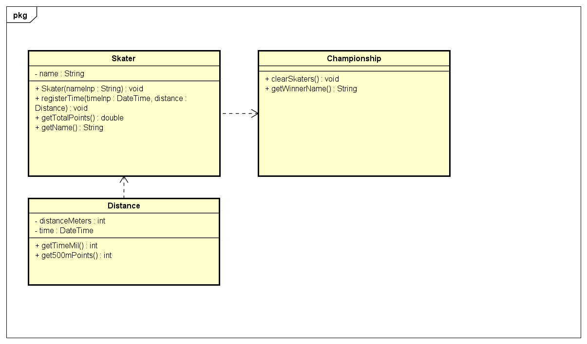

# Start Document for "Skating Championship"
Start document written by Mathew Shardin. Student code **4951735**

## Problem Description
>A number of skaters take part in a skating championship. The following
distances are skated consecutively: 500 metres, 5000 metres, 1500 metres and
10000 metres. Times are registered precisely to hundredths of seconds. The
time achieved for the various distances is converted into points by reducing
each time to a 500 metre time. The skater with the lowest total number of
points wins the championship.
A program must be developed in which the name and times (format mmsshh)
can be entered for each consecutive competitor. The points total of each skater
must then be calculated and shown, as well as who the winner is. 

A speed skating board of juries needs an application that helps to determine a winner in a competition. The programm must track the following things:
1.  Times (format hh:mm:ss.hhh) for 500, 5000, 1500, 10000 meter distances
2.  Names of the athletes
3.  Total number of points

The application must be able to:
1. Register names and times of the athletes
2. Calculate the total number of points per each athlete
3. Determine the winner with lowest number of total points

Additional application requirements:
1. Contain 3 tabs
2. Contain a start-up splash screen
3. Contain an about box
4. Be displayed in the (Quick Launch) toolbar
5. The program contains a context menu, which has the following options: a shortcut to each tab, shortcut to the about box, open and close buttons

## Input & Output
In this section the inputs and outputs of the application are described. The tabe below provides all the inputs a user has to introduce to make the application function.
| Case          | Data Type | Conditions |
|---------------|-----------|------------|
| Skater's name | String    | Not empty  |
| 500m time     | String  | `time` in format hh:mm:ss.hhh   |
| 5000m time    | String  | `time` in format hh:mm:ss.hhh   |
| 1500m time    | String  | `time` in format hh:mm:ss.hhh   |
| 10000m time   | String  | `time` in format hh:mm:ss.hhh   |

The table below provides all the outputs a user can see.
| Case                   | Data Type |
|------------------------|-----------|
| Athletes' names        | String    |
| Athletes' total points | Double    |
| Winner's name          | String    |

The tabe below provides all the calculation done by the application.
| Case                             | Calculation                                                  |
|----------------------------------|--------------------------------------------------------------|
| Convert times to a 500m distance | `DateTime converted to integer milliseconds`/(`distance`/500)      |
| Total number of points           | Sum of `time` in milliseconds for all distances converted to a 500m distance |

## Class Diagram

## Test Plan
**Test Data**
The tables below provide the data used for testing.
| Id   | Input                     |
|------|---------------------------|
| sk01 | Name: "Fillipe Mota"      | 
|      | 500m time: 00:00:45.126   | 
|      | 1500m time: 00:01:45.126  | 
|      | 5000m time: 00:33:24.056  | 
|      | 10000m time: 01:01:12.128 | 
| sk02 | Name: "Jamie Foy"         | 
|      | 500m time: 00:01:01.069   | 
|      | 1500m: 00:02:12.244       | 
|      | 5000m time: 00:43:24.056  |
|      | 10000m time: 01:33:24.228 |

**Test Cases**
Tables below provide information about test cases. All tests are performed with the test data (described above)

1.**Get Winner**

| Step | Input        | Action                                    | Expected output |
|------|--------------|-------------------------------------------|-----------------|
| 1    | Input test data SK01| Press "Save" button on "Add+" page|                 |
| 2    | Input test data SK02| Press "Save" button on "Add+" page|                 |
| 3    | Button Click| Press "Update" button on "Winner" page| "Fillipe Mota"  |
| 4    |Input test data for 3rd skater on "Add+" page|name = "Chris Joslin" |                 |
| 5    |Input test data for 500m|00:00:10.126 |                 |
| 6    |Input test data for 1500m|00:00:12.126|                 |
| 7    |Input test data for 5000m|00:00:20.126|                 |
| 8    |Input test data for 10000m| 00:00:30.126 |                 |
| 9    |Button click| Press "Save" button on "Add+" page |                 |
| 10   | Button Click | Press "Update" button on "Winner" page| "Chris Joslin"  |

2. **Display Total Points**

| Step | Input | Action                | Expected output |
|------|-------|-----------------------|-----------------|
| 1    |Input test data SK01|Press "Save" button on "Add+" page||
| 2    |Input test data SK01|Press "Save" button on "Add+" page||
| 3    |Open "Result" page|Look at "Fillipe Mota" record| 464180|
| 4    |Open "Result" page|Look at "Jamie Foy" record| 645767.3 |

3. **Clear all results**

| Step | Input | Action                | Expected output |
|------|-------|-----------------------|-----------------|
| 1    |Input test data SK01|Press "Save" button on "Add+" page||
| 2    |Input test data SK01|Press "Save" button on "Add+" page||
| 3    |Open "Result" page|Look at "Fillipe Mota" record| 464180|
| 4    |Open "Result" page|Look at "Jamie Foy" record| 645767.3 |
| 5    |Button click|Press "Clear" button|Empty results table|

## Graphical User Interface

